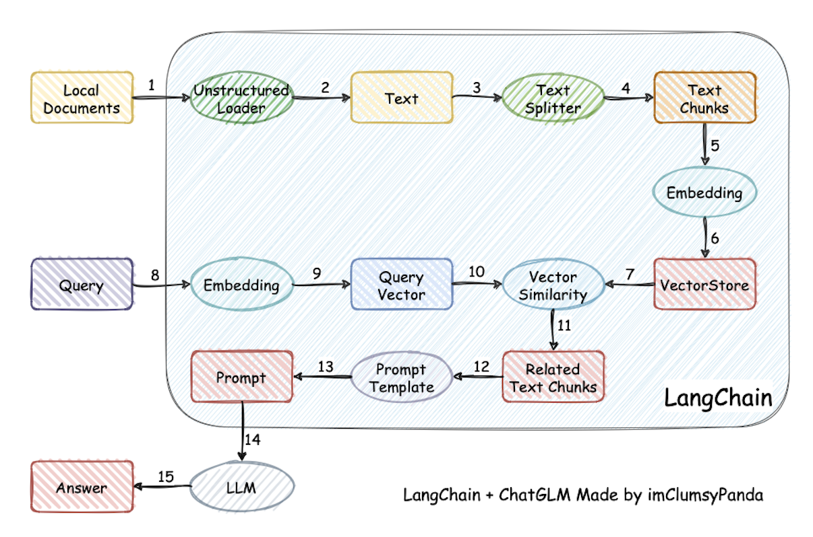
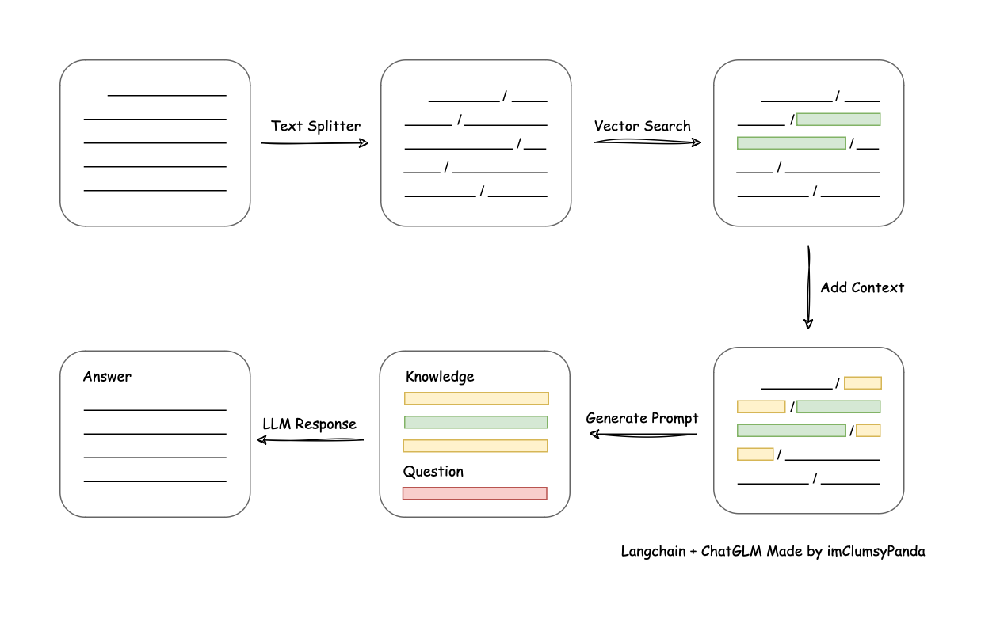
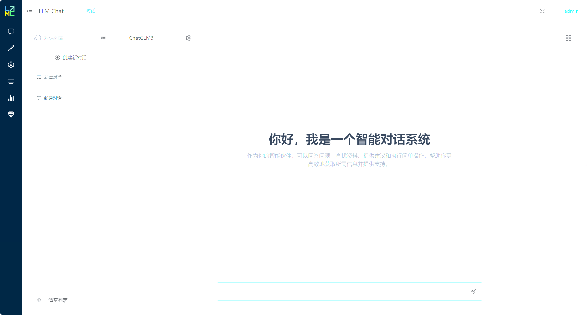
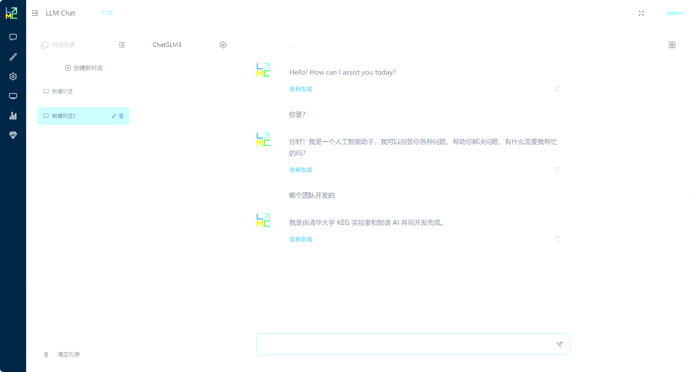
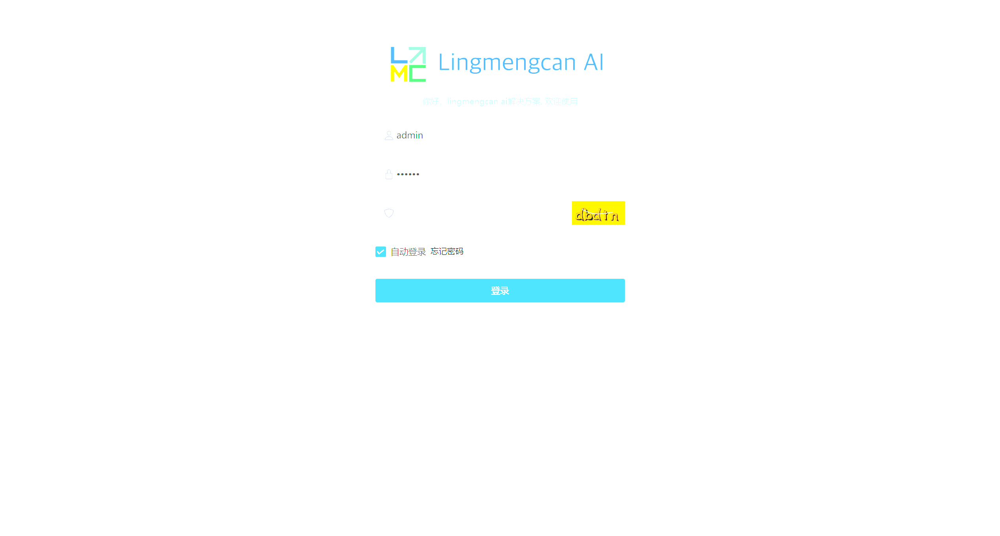
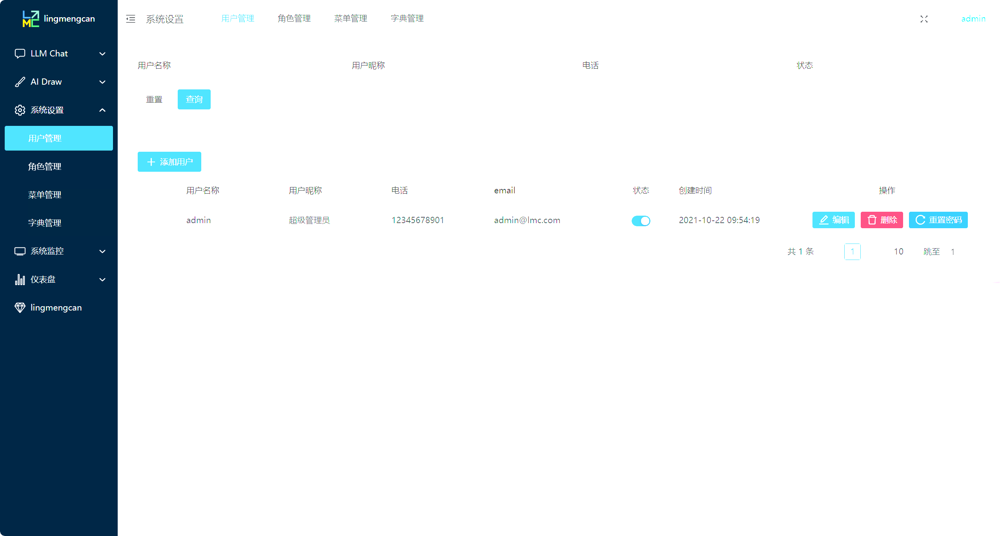
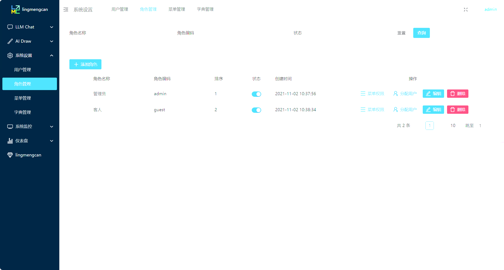
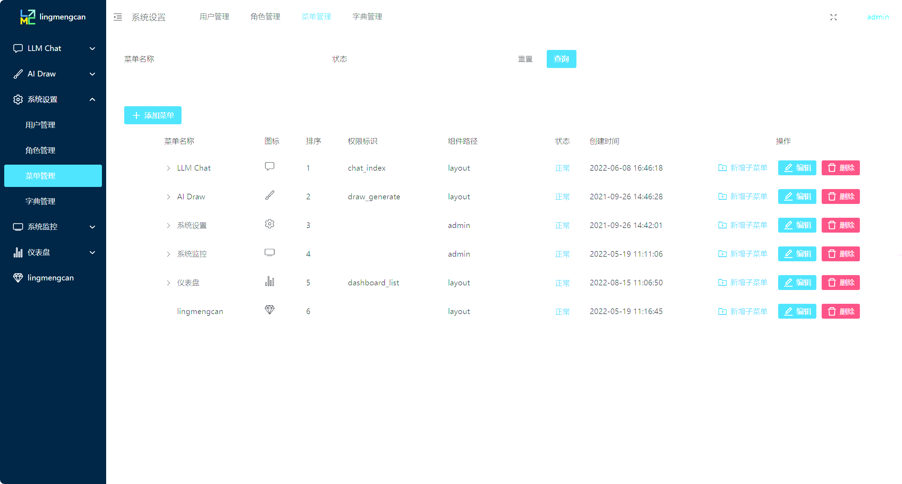
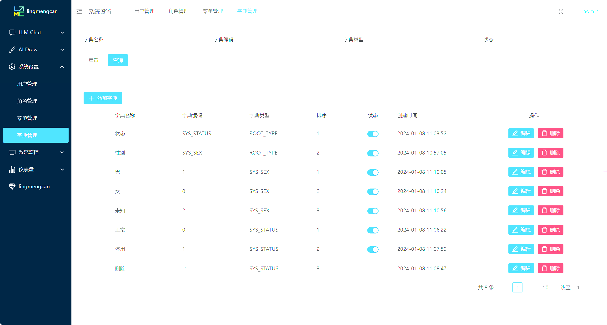

# 大模型AI应用平台 lingmengcan-ai

lingmengcan-ai 是一个基于大模型的ai系统，目前提供对话和后台角色管理。使用的技术栈，包括Vue 3、Naive UI和Tailwind CSS构建UI层，以及NestJS、LangChainJS和MySQL为服务层;该项目是一个可以实现 __完全本地化__推理的知识库增强方案, 重点解决数据安全保护，私域化部署的企业痛点。

## 特点
- **大模型**: 使用openai或者本地本地部署ChatGLM3 (https://github.com/THUDM/ChatGLM3) ，用openai api的格式统一所有本地模型
- **对话**: 支持与大型语言模型进行高效、自然的对话交互。
- **角色管理**: 包含一个完整的后台角色管理模块，便于用户管理和权限控制。
- **AIGC功能**: 后续完善。
- **推理和训练**: 后续完善。

## 技术栈

- **UI层**: 使用 Vue 3、Naive UI、Tailwind CSS
- **服务层**: 使用 NestJS、LangChainJS、MySQL 实现业务逻辑开发与数据处理，提高与拓展模型层的性能，提供对话、aigc、训练、推理和后台管理等你功能；对话参考项目 https://github.com/chatchat-space/Langchain-Chatchat 持续优化。
    依托于本项目支持的开源 LLM 与 Embedding 模型，本项目可实现全部使用开源模型离线私有部署。与此同时，本项目也支持 OpenAI GPT API 的调用，并将在后续持续扩充对各类模型及模型 API 的接入。
    本项目实现原理如下图所示，过程包括加载文件 -> 读取文本 -> 文本分割 -> 文本向量化 -> 问句向量化 -> 在文本向量中匹配出与问句向量最相似的 top k个 -> 匹配出的文本作为上下文和问题一起添加到 prompt中 -> 提交给 LLM生成回答。

    

    从文档处理角度来看，实现流程如下：
    

## 快速开始

### 环境要求

确保您的开发环境满足以下要求：

- Python 3.10+
- Node.js 18+
- MySQL 5.7+

### 如果本地已有模型：从本地加载模型

请参考 [THUDM/ChatGLM3#从本地加载模型](https://github.com/THUDM/ChatGLM3#从本地加载模型)
- 克隆ChatGLM3项目
- cd openai_api_demo
- python api_server.py
就启用了本地chatglm 服务，硬件配置参考ChatGLM3要求

### 安装

#### 存储层(mysql)
- 安装mysql，然后导入根目录的 lingmengcan.sql 文件

#### 服务层(service)
- 安装依赖
    cd service
    pnpm install
- 配置
  - config.development.yaml\
    在项目的根目录下，设置config.development.yaml，chatglm3_6b_server_url为chatGLM3的ip地址 或者 openai_api_key
- 运行
    pnpm run start

#### 前端UI层
- 安装依赖
    cd web
    pnpm install
- 运行
    pnpm dev

现在，您可以通过访问 http://localhost:8089 来体验lingmengcan-ai。

### 项目截图

