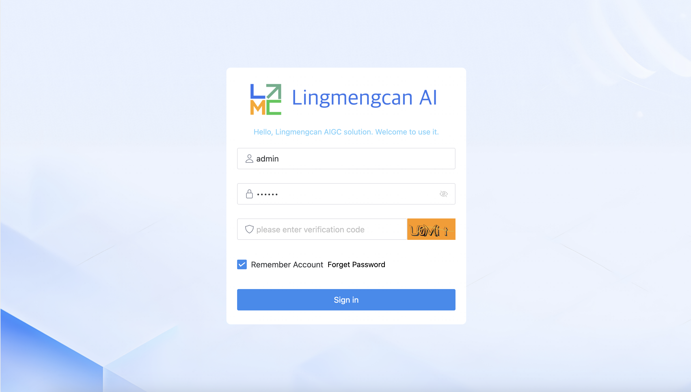

<h1 align="center">AIGC Application Platform: Lingmengcan AI</h1>
<p align="center">English | <a href="README.zh-CN.md">中文</a> </p>

Lingmengcan AI is an AI system based on large models.Currently, it provides functions such as large language model dialogue, model management, text-to-image generation, and background role management. The technology stack used includes Stable Diffusion, OpenAI, ChatGPT, LangChainJS as the AI layer, Vue 3, Naive UI, and Tailwind CSS for the UI layer, and NestJS, LangChainJS, Ollama, and MySQL for the service layer, with ChromaDB as the vector database. This project is a knowledge base enhancement solution that can achieve **fully localized** reasoning and also provides AIGC functions, focusing on solving the pain points of enterprises regarding data security protection and private domain deployment.

## Community

- QQ Group 1 651535270

## Features

- **Large Language Model**: Use OpenAI (ChatGPT) or locally deploy ChatGLM3 (https://github.com/THUDM/ChatGLM3) , and unify all local models in the OpenAI API format.
- **Chat**: Support efficient and natural dialogue interaction with large language models.
- **Admin Management**: Include a complete background role management module for convenient user management and permission control.
- **AI Draw**: Locally deploy Stable Diffusion WebUI (https://github.com/AUTOMATIC1111/stable-diffusion-webui) , and enable the API mode.
- **Inference and Train**: To be improved later.
- **Private Domain Deployment**: Support fully localized deployment without relying on the public network.

## Technology Stack

- **UI Layer**: Use Vue 3, Naive UI, Tailwind CSS
- **Service Layer**: Use NestJS and LangChainJ to implement business logic development and data processing, improve and expand the performance of the model layer, and provide functions such as dialogue, AIGC, training, reasoning, and background management; the dialogue refers to the project https://github.com/chatchat-space/Langchain-Chatchat and is continuously optimized.
  Relying on the open-source LLM and Embedding models supported by this project, this project can achieve all offline private deployment using open-source models. At the same time, this project also supports the call of OpenAI GPT API and will continue to expand the access to various models and model APIs in the future.
  The implementation principle of this project is shown in the following figure. The process includes loading files -> reading text -> text segmentation -> text vectorization -> question vectorization -> matching the top k most similar to the question vector in the text vector -> adding the matched text as the context and the question together to the prompt -> submitting to the LLM to generate the answer.

  

  From the perspective of document processing, the implementation process is as follows:
  

  AIGC text-to-image generation, by calling the Stable Diffusion WebUI interface, generates images.
  

- **Data Layer**: Use MySQL, ChromaDB, and later add Redis and MongoDB

## Quick Start

### Environmental Requirements

Ensure that your development environment meets the following requirements:

- Python 3.10+
- Node.js 18+
- MySQL 5.7+

### Local Deployment of Stable Diffusion WebUI or Configuration in the Configuration File

- stablediffusion:
  apiUrl: 'http://localhost:7861'

  Local deployment reference[stable-diffusion-webui](https://github.com/AUTOMATIC1111/stable-diffusion-webui)

### If You Have a Large Language Model Locally: Load the Model from Local

#### Ollama

Reference for Deploying Models Locally with Ollama [https://github.com/ollama/ollama](https://github.com/ollama/ollama)

#### ChatGLM3

Please refer to [THUDM/ChatGLM3#Load the Model from Local](https://github.com/THUDM/ChatGLM3#从本地加载模型)

```bash
# Download the model
git clone https://github.com/THUDM/ChatGLM3
# Install dependencies
# Start the model
cd ChatGLM3/openai_api_demo
python api_server.py
```

The local API service of the local chatglm3 openai mode is enabled. The hardware configuration refers to the requirements of ChatGLM3

### Installation

#### Storage Layer (MySQL、ChromaDB)

- Install MySQL, then import the lingmengcan.sql file in the doc directory, and configure the MySQL connection in the configuration file.
- Install ChromaDB, and configure the ChromaDB connection in the configuration file.

#### Service Layer (Service)

- Install dependencies
  cd service
  pnpm install
- Configuration
  config.development.yaml, in the system model management section, set the corresponding URL and API key of the model (if needed)
- Run
  pnpm run start

```bash
# Install dependencies
  cd service
  pnpm install
# Configuration
# config.development.yaml, in the system model management section, set the corresponding URL and API key of the model (if needed)
# Run
  pnpm run start
```

#### Front-End UI Layer

```bash
# Install dependencies
  cd web
  pnpm install
# Run
  pnpm dev
```

Now, you can experience Lingmengcan AI by visiting http://localhost:8089.

### Screenshots and Function Demonstration

- Large Language Model Dialogue 1
  

- Large Language Model Dialogue 2
  

- Large Language Model Management
  

- Text-to-Image
  

- Login
  

- User Management
  

- Role Management
  

- Menu Management
  

- Dictionary Management
  
