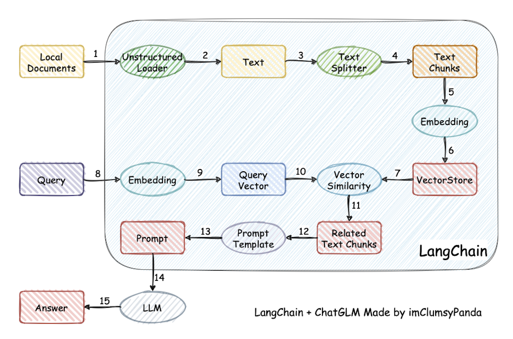
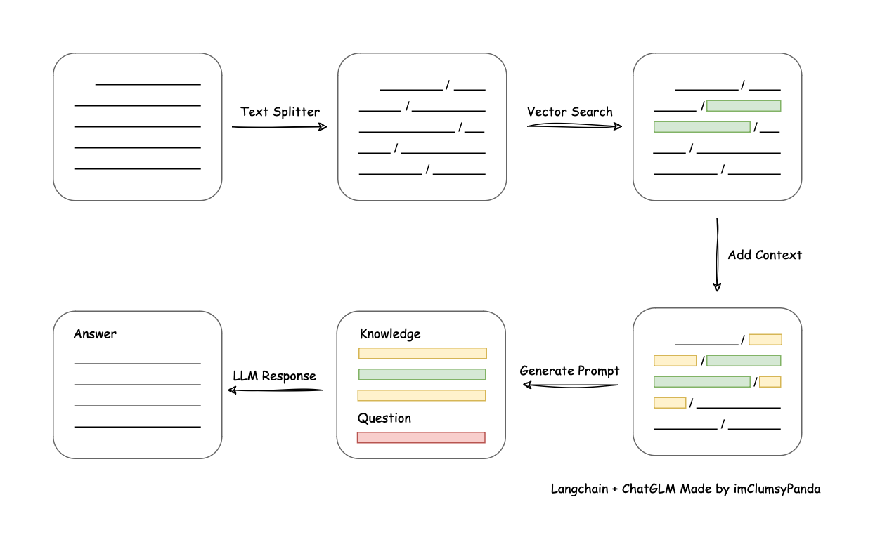
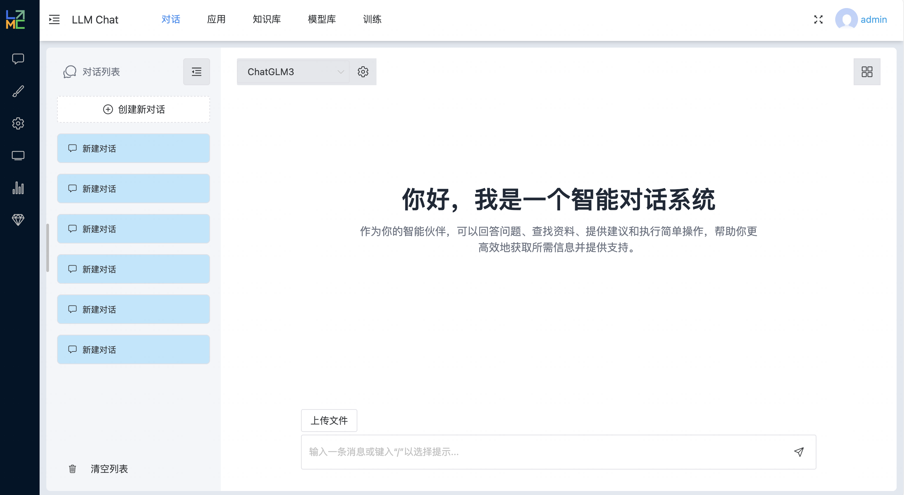
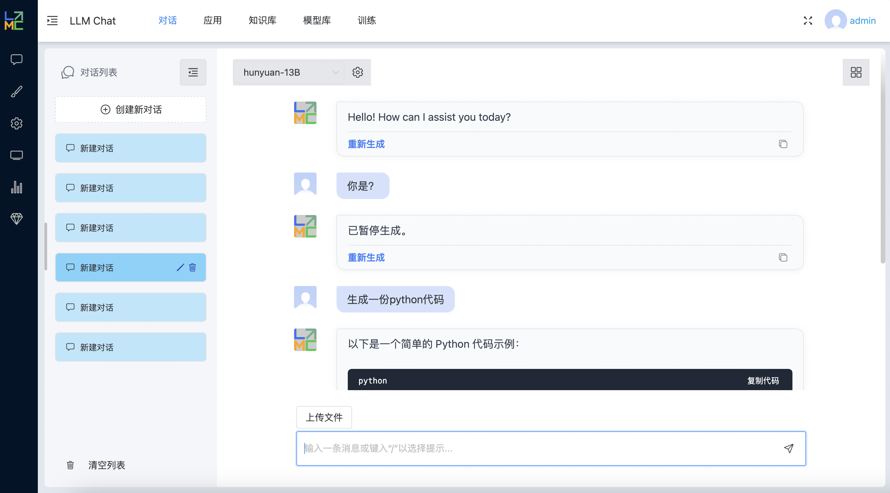
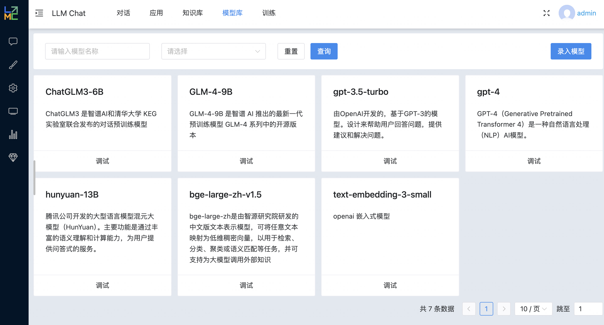
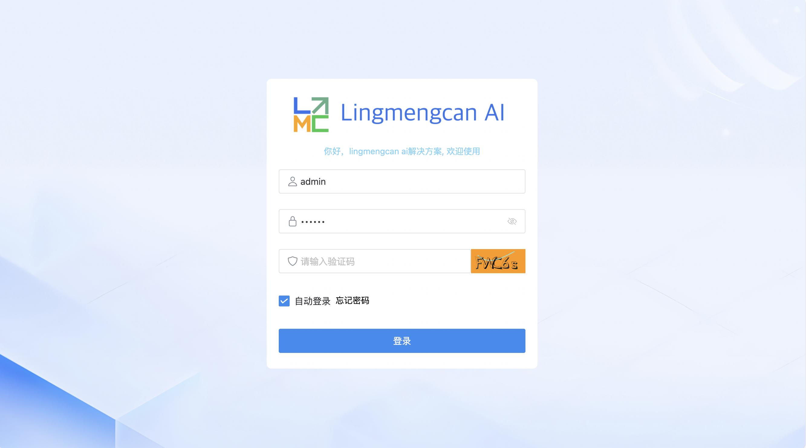
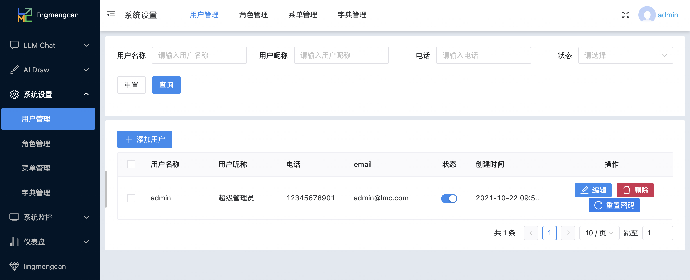
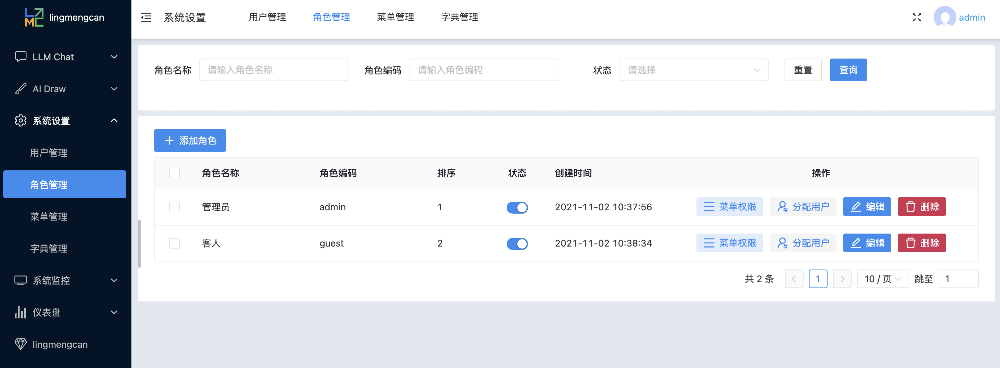
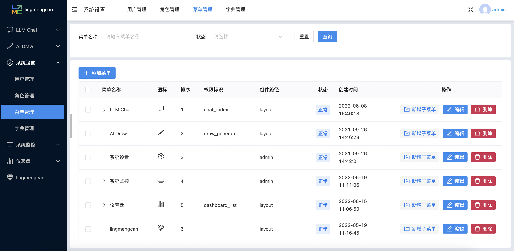
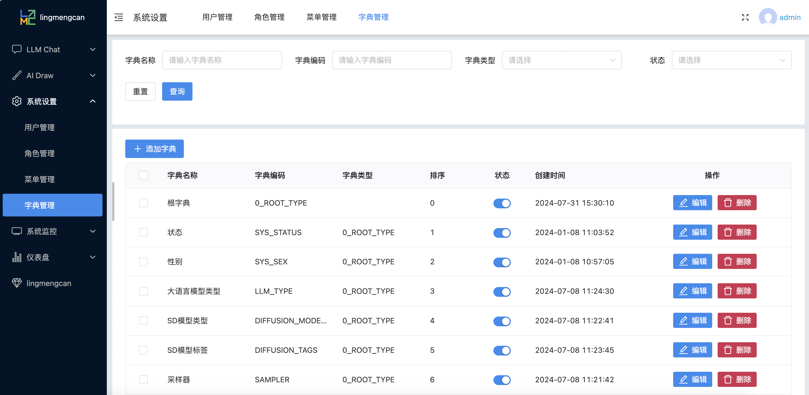

<h1 style="text-align: center;">大模型 AI 应用平台 Lingmengcan AI</h1>

  <a href="./Readme.md">中文</a> ｜ <a href="./Readme.en-US.md">English</a>

lingmengcan-ai 是一个基于大模型的 ai 系统，目前提供大语言模型对话、模型管理、文生图和后台角色管理等等功能。使用的技术栈，包括 stable deffusion、openai、chatgpt、LangChainJS 作为 ai 层，Vue 3、Naive UI 和 Tailwind CSS 构建 UI 层，以及 NestJS、LangChainJS、MySQL 为服务层，chromadb 为向量数据库。该项目是一个可以实现**完全本地化**推理的知识库增强方案，同时提供 AIGC 功能， 重点解决数据安全保护，私域化部署的企业痛点。

## 特点

- **大模型**: 使用 openai(ChatGPT)或者本地本地部署 ChatGLM3 (https://github.com/THUDM/ChatGLM3) ，用 openai api 的格式统一所有本地模型。
- **对话**: 支持与大型语言模型进行高效、自然的对话交互。
- **角色管理**: 包含一个完整的后台角色管理模块，便于用户管理和权限控制。
- **AI 画图功能**: 本地部署 stable diffusion webui (https://github.com/AUTOMATIC1111/stable-diffusion-webui) ，并打开 api 模式。
- **推理和训练**: 后续完善。
- **私域化部署**: 支持完全本地化部署，无需依赖公网网络。

## 技术栈

- **UI 层**: 使用 Vue 3、Naive UI、Tailwind CSS
- **服务层**: 使用 NestJS、LangChainJ 实现业务逻辑开发与数据处理，提高与拓展模型层的性能，提供对话、aigc、训练、推理和后台管理等你功能；对话参考项目 https://github.com/chatchat-space/Langchain-Chatchat 持续优化。
  依托于本项目支持的开源 LLM 与 Embedding 模型，本项目可实现全部使用开源模型离线私有部署。与此同时，本项目也支持 OpenAI GPT API 的调用，并将在后续持续扩充对各类模型及模型 API 的接入。
  本项目实现原理如下图所示，过程包括加载文件 -> 读取文本 -> 文本分割 -> 文本向量化 -> 问句向量化 -> 在文本向量中匹配出与问句向量最相似的 top k 个 -> 匹配出的文本作为上下文和问题一起添加到 prompt 中 -> 提交给 LLM 生成回答。

  

  从文档处理角度来看，实现流程如下：
  

  AIGC 文生图，通过调用 stable diffusion webui 接口，生成图片。
  

- **数据层**: 使用 MySQL、chromadb，后续加入 redis、mongodb

## 快速开始

### 环境要求

确保您的开发环境满足以下要求：

- Python 3.10+
- Node.js 18+
- MySQL 5.7+

### 本地部署 stable diffusion webui 或者，在配置文件配置

- stablediffusion:
  apiUrl: 'http://localhost:7861'

  本地部署参考[stable-diffusion-webui](https://github.com/AUTOMATIC1111/stable-diffusion-webui)

### 如果本地已有大语言模型：从本地加载模型

请参考 [THUDM/ChatGLM3#从本地加载模型](https://github.com/THUDM/ChatGLM3#从本地加载模型)

- 克隆 ChatGLM3 项目
- cd openai_api_demo
- python api_server.py
  就启用了本地 chatglm 服务，硬件配置参考 ChatGLM3 要求

### 安装

#### 存储层(mysql、chromadb)

- 安装 mysql，然后导入根目录的 lingmengcan.sql 文件，同时在配置文件配置 mysql 连接
- 安装 chromadb，同时在配置文件配置 chromadb 连接

#### 服务层(service)

- 安装依赖
  cd service
  pnpm install
- 配置
  - config.development.yaml，在系统模型管理里面，设置模型对应 url 和 api_key（如需要）
- 运行
  pnpm run start

#### 前端 UI 层

- 安装依赖
  cd web
  pnpm install
- 运行
  pnpm dev

现在，您可以通过访问 http://localhost:8089 来体验 lingmengcan-ai。

### 项目截图和功能演示

- 大语言模型对话 1
  

- 大语言模型对话 2
  

- 大语言模型管理
  

- 文生图
  

- 登录
  

- 用户管理
  

- 角色管理
  

- 菜单管理
  

- 字典管理
  
